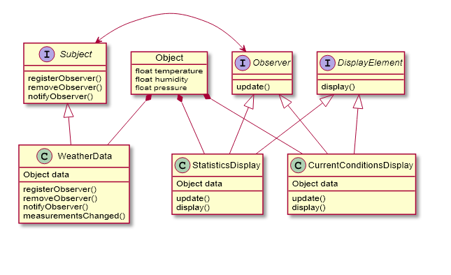

# Design-Pattern
the record of Design Pattern Learning
- [Design-Pattern](#design-pattern)
  - [Stategy](#stategy)
  - [Observer](#observer)
  - [Decorator](#decorator)
  - [Factory](#factory)
  - [Singleton](#singleton)
  - [Command](#command)
  - [Adapter](#adapter)
  - [Facade](#facade)
  - [Template method](#template-method)
  - [Iterator](#iterator)

## Stategy

## Observer

## Decorator

## Factory

### Factory Method

### Abstract Factory

## Singleton

### Target

Create a global access class for Setting or thread managing ... etc.

### Method
It uses a static variable, a private constructor and a public static function - `getInstance()` to make sure that only one instance of class exists.

## Command

### Target

Decouple the object request the command and perform the command.

### Method

It uses a command interface with execute action, and through invoker to active the command behavior. 

## Adapter

### Target

Make interface convert to another interface.

### Method

It uses a adapter class to turn the original interface to the new one.

## Facade

### Target

Don't provide unnecessary information for client to operate and make client code as simple as possible.

### Method

It uses a facade interface to restructure a set of complex interfaces. It makes the facade interface only provide necessary operate functions for clients.

## Template method

### Target

Decouple low-level & high-level components. make high-level decide algorithms and low-level decide the detail of different class.

### Method

It use an abstract class with functions to build algorithms. When concrete class inherits the abstract class, it can overwrite some of these classes to provide flexibility for different classes.

## Iterator

### Target

Through a common interface for traversing the data in any aggregate data structure (ex. array, vector, link list, hash map, etc.)

### Method

It use a interface called Iterator with function - hasNext() & next() to implement traverse feature. Make the aggregate to implement the Iterator interface by themselves. Thus, every aggregate supporting Iterator have the traverse feature.

